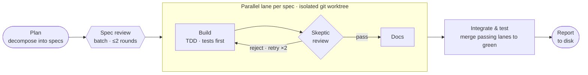

# runspec

A drop-in **spec-driven, test-first agentic workflow** for Claude Code: hand Claude a build goal
and it runs a full loop across parallel subagents — planning, building, reviewing, integrating —
then writes a structured report a human reads to decide what happens next. Claude reaches for it
on its own; `/runspec` is the explicit trigger.



Install it into any git repo with `install.sh` and run `/runspec`.

## What it does

`/runspec` is a [dynamic workflow](https://docs.claude.com/en/docs/claude-code) (`.claude/workflows/runspec.mjs`)
that orchestrates a fleet of subagents through five phases:

1. **Plan** — a planner decomposes the goal into as many independent, non-overlapping specs as it
   naturally divides into (Claude decides the count, favoring parallel-friendly splits),
   each following `specs/SPEC_TEMPLATE.md`, written to `specs/`.
2. **Spec review** — one reviewer critiques all specs as a batch (≤2 rounds), catching
   cross-spec file collisions *before* the fan-out. Governed by the `spec-review` skill.
3. **Work lanes** — one lane per spec, running **in parallel, each in its own git worktree**
   so they can't collide. Each lane: a builder works the spec's `## Implementation Tasks` **in
   order — TDD, tests first** (`test-driver` skill), checking off each box → a fresh skeptic
   reviewer diffs it against the spec section-by-section, confirms the tests are real, and runs
   them → on pass, the `docs-maintainer` skill updates `docs/`. Rejections retry with objections
   attached (cap 2).
4. **Integrate** — merge only the lanes that passed, resolve conflicts, loop the project's
   build/test to green, and clean up the worktrees.
5. **Report** — a reporter compiles a structured Markdown run report (what shipped, what docs
   changed, open questions needing a decision, proposed next steps) to `run-reports/`, then as a
   final step deletes the completed specs — escalated/unresolved specs stay in `specs/`, so a run
   ends holding only open work.

Escalations are never silently resolved. They surface as **open questions** in the
report for a human to decide.

## Use it

Claude discovers the workflow in `.claude/workflows/` and runs it on its own. 
Hand it a substantial, parallelizable build task in plain language and it reaches
for runspec, plans, fans out the lanes, integrates, and reports, without you invoking anything.
It stays hands-on for the small stuff (a quick edit, a one-file fix). 
You can modify the behavior by explicitly documenting your preferences.

Manual `/runspec` is the explicit form — for forcing a run or passing exact inputs:

```
/runspec with goal 'Add rate limiting to the public API' and direction 'keep the 60rps default'
```

- **goal** (required) — the run objective.
- **direction** (optional) — standing guidance carried over from a previous review.
- **runId** (optional) — names the report file; otherwise the reporter derives a slug.

The report lands at `run-reports/<runId>.md` (plus a `.json` raw record). Read it,
decide the next move, and run `/runspec` again with the new goal/direction. That manual
read-and-redirect loop is the human-in-the-loop gate.

## Setup

Setup has two options: a deterministic file copy (`install.sh`) and a per-project fit done by an
interactive agent following [`SETUP.md`](SETUP.md) — interview/scaffold for new repos, discover
and adapt for existing ones.

```bash
# 1. mechanical: drop the bundle into the target repo (run from the repo, or pass its path)
bash /path/to/claude-runspec/install.sh .

# 2. interactive: open Claude Code in that repo and say:
#    "set up runspec by following SETUP.md"
```

`install.sh` is idempotent and conflict-aware (it won't clobber an existing `specs/SPEC_TEMPLATE.md`
or same-named skill — it reports them; `--force` overrides). `SETUP.md` never runs `/runspec`;
it leaves you ready to launch the first run yourself.

**What gets written to your repo.** The bundle lives under `.claude/` (workflow, skills, and a
`settings.json` that pre-approves the workflow's git commands) plus the tracked
`specs/SPEC_TEMPLATE.md`. `install.sh` also adds these `.gitignore` entries:

- `.worktrees/` — the isolated build-lane checkouts.
- `specs/*` (with `!specs/SPEC_TEMPLATE.md`) — **generated specs are ephemeral per-run artifacts;
  only the template is tracked.** Note: if your repo already keeps hand-written files under `specs/`,
  newly added ones will be ignored from here on (already-tracked files are unaffected) — move them
  or adjust the rule if you want them versioned.

## Customize

- **Where the report goes.** The Report phase (phase 7 in `runspec.mjs`) is the only delivery
  seam — everything above it is delivery-agnostic and hands off a clean `runRecord` object.
  Swap that phase to open a PR comment, or message Slack instead of (or in addition to) writing to disk.
- **Tests.** The Integrate phase requires the project's tests to pass before merging. The test
  command is inferred from the project; documenting it in `CLAUDE.md`/`AGENTS.md` makes that reliable.
- **Permissions.** Workflow subagents always run in `acceptEdits` mode, which auto-approves file
  edits and `rm`/`mkdir`/etc. but prompts on `git merge`, `git worktree`, and the test command.
  The shipped `.claude/settings.json` pre-approves the workflow's git commands; setup adds your
  test command. Trim entries (or delete the file) to tighten — at the cost of a prompt per command.
- **Caps.** `MAX_SPEC_REVIEW_ROUNDS` and `MAX_BUILD_ATTEMPTS` at the top of `runspec.mjs`.
- **Model routing.** Planner/reviewers/docs run on `sonnet`; builders, integrator, and reporter
  inherit the session model. Adjust the `model:` options per `agent()` call.

